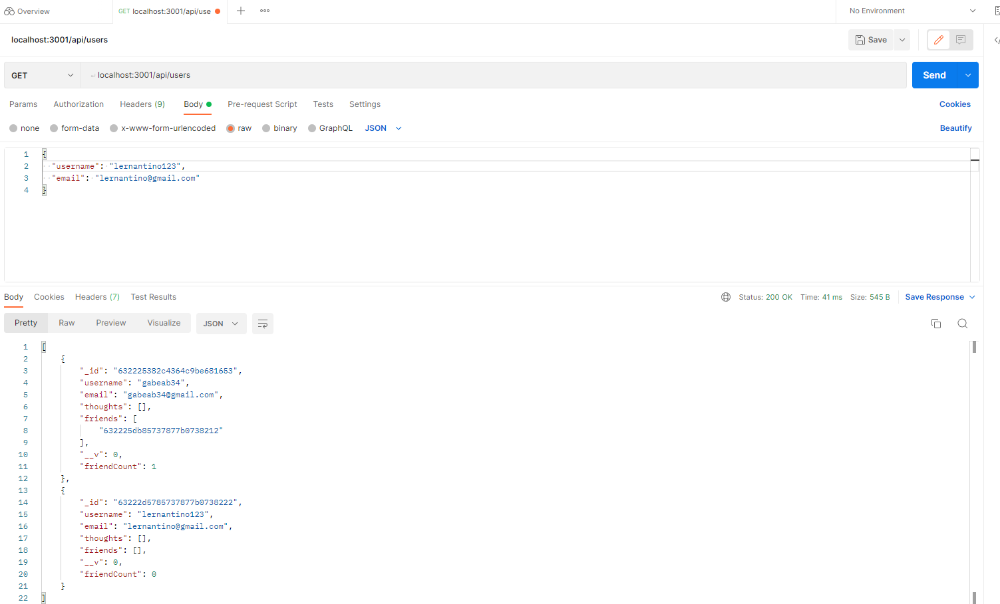

  # Social Network API

  

  ## Table of Contents:

  * [Description](#Description)

  * [Installation](#Installation)

  * [Usage](#Usage)

  * [Contributions](#Contributions)

  * [Test](#Tests)

  * [Email](#Questions)

  * [Github](#Questions)

  ## Description: 
  This project approximates a social network by using API routes and calls to creates users, make friends, post thoughts and reactions

  ## Installation: 
  npm i express, npm i mongoose
  
  ## Usage: 
  Here are 3 videos demonstrating the API routes for the project:
  https://drive.google.com/file/d/1g2dms3QF1k0OZQAB2aO6-cmUZoQ7SwQX/view
  https://drive.google.com/file/d/1ls4XlKw6yie4wRI3CD72z76y7kfAjSbg/view
  https://drive.google.com/file/d/1LV9HRh5hW-lA9amWOwFIeYEQMnrui6iN/view
  ## License:
  none 
  

  ## Contributions: 
  No contributions needed

  ## Tests: 
  No tests needed

  ## Questions:

  [Email](mailto:gabeab34@gmail.com)

  [GitHub](https://github.com/gabeab34)

